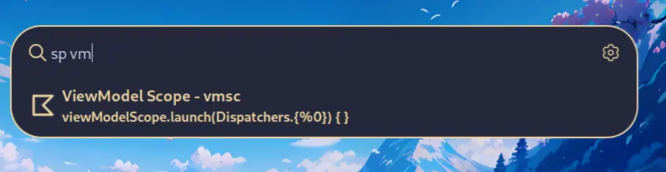

  

# About
This extension lets you add code snippets right from the launcher. You probably have been in a situation where you need a snippet outside of your IDE
or some way to have parameters in the snippet.

# How To Use
## Add
You can add a snippet by selecting the inital option

## Edit
To edit a snippet you can type `e` or `edit` as the first word and then the snippet keyword. It will show a popup like the add one.

Basically: `e {keyword}` or `edit {keyword}`

## Delete
To edit a snippet you can type `d` or `delete` as the first word and then the snippet keyword.

Basically: `d {keyword}` or `delete {keyword}`
